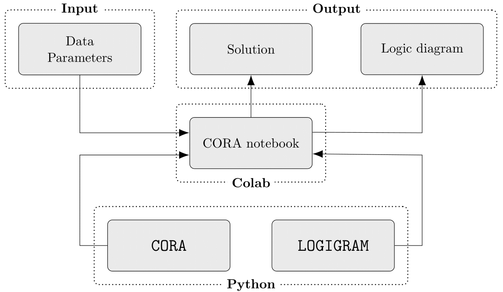
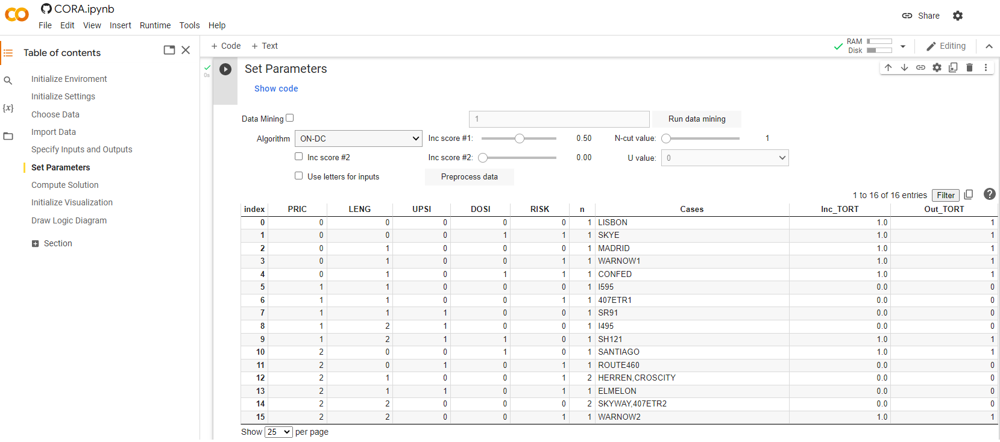
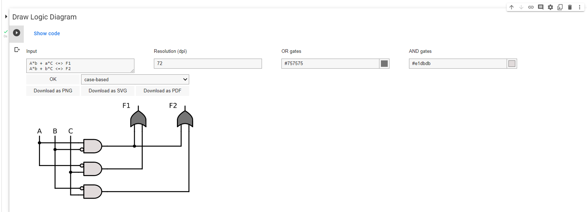
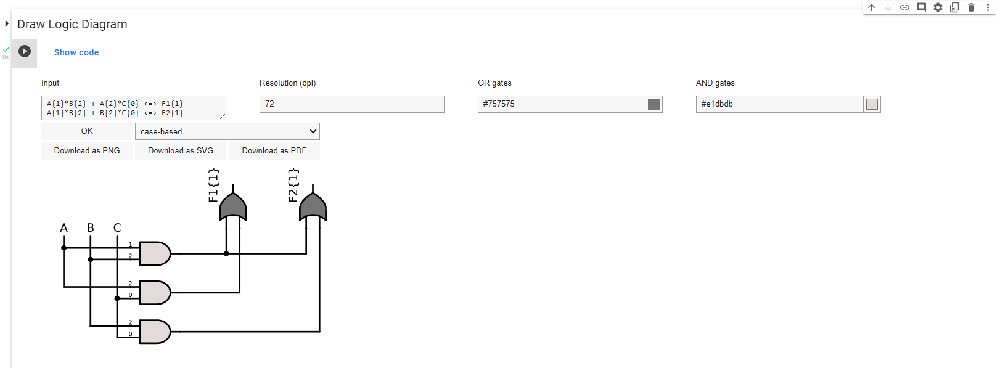

# Summary 

Combinational Regularity Analysis (CORA) [@thiem_et_al_forth] is a new member
in the family of configurational comparative methods (CCMs). Modern CCMs
infer INUS structures from sets of configurational data. CORA
generalizes the capabilities of exiting CCMs through its ability to
model multi-output data. It can thus infer INUS structures that include
complex conjunctive effects. The accompanying and eponymous package
`CORA` is an open-source Python tool, hosted on GitHub and deployed on
the Google Colab platform.

# Statement of need

Modern configurational comparative methods (CCMs) can infer
regularity-theoretic causal structures from categorical data. The most
sophisticated of these structures are so-called INUS structures [@mackie_1965]. INUS structures are codified as two-level
Boolean functions, such as $a\cdot b' + c' \Leftrightarrow z$, where
$a$, $b$, $c$ and $z$ are Boolean literals, $\text{"} . \text{"}$ represents the
Boolean multiplication operator, $\text{"} + \text{"}$ the Boolean addition operator,
$\text{" } ' \text{ "}$ the Boolean negation operator, and $\text{"}\Leftrightarrow\text{"}$ the
Boolean implication operator. Branches of Boolean algebra include, most
importantly, set theory, propositional logic and switching circuit
theory [@lewin_protheroe_1992].

So far, the two most sophisticated CCMs have been Qualitative
Comparative Analysis (QCA) [@ragin_1987] and
Coincidence Analysis
(CNA) [@baumgartner_2009]. For QCA, several
software packages exist, each with different functionality
[@cronqvist_2019; @dusa_2021, @ragin_davey_2019, @thiem_2018].
However, since there is no harmonization on procedures in QCA, different
software packages often generate different results
[@thiem_dusa_2013]. For CNA, the `cna` package is
available [@ambuhl_baumgartner_2021].

QCA and CNA can analyze single outputs only. Although CNA has been built
for analyses with multiple outputs, its algorithm has to process each
output one after another. Many scientific research problems, however,
require the simultaneous analysis of multiple effects, such as analyses
of multimorbidity [@suls_green_2019]. CORA offers a
solution. It generalizes QCA and CNA by allowing the simultaneous
analyses of multiple outputs, and can therefore discover more complex
INUS structures. To this end, CORA implements adaptations of
optimization algorithms originally developed for the design of
multi-output switching circuits. Second, CORA offers a systematic
possibility to mine configurational data. Third, CORA draws on logic
diagrams to communicate its results. The software tool `CORA` implements
the eponymous method.

# Functionality and design 

Figure <a href="#fig:structure" data-reference-type="ref" data-reference="fig:structure">1</a>
shows the internal structure of `CORA`. Two distinct Python packages
constitute its foundation. While the `CORA` package is responsible for
algorithmic optimization, the `LOGIGRAM` package provides graphical
functionality for the production of logic diagrams. On the middle layer,
these two Python packages are combined in CORA’s Colab notebook, which
provides the visual interface to the user. This end-user interface
represents the top level of `CORA` on which all interactions between the
user and software take place. The input the user has to provide include
a set of CORA-compatible data and the specification of modelling
parameters. Following the process of algorithmic optimization, a
solution is generated. In CORA, such solutions take the form of
irredundant systems of Boolean functions. These functions, or any
function in disjunctive normal form, can then also be rendered through
`LOGIGRAM` as a logic diagram.

Figure 1: The structure of CORA

The user interface of CORA’s Colab notebook is shown in
Figure <a href="#fig:notebook" data-reference-type="ref" data-reference="fig:main">2</a>.
It guides users through the analysis in nine steps, the last two of
which are optional: (1) the initialization of the framework and (2)
default settings, the (3) choice and (4) import of data, the (5)
specification of the inputs and outputs, the (6) setting of search
parameters and thresholds for data fit statistics, (7) the computation
of the solution, (8) the initialization of `CORA`’s visualization module
and finally (9) the drawing and export of logic diagrams.

Figure 2: Interface of CORA's Colab notebook

# Graphics 

Logic diagrams are graphical representations of Boolean-algebraic
functions that have so far almost exclusively been used in electrical
engineering. Over the last 10 years, however, scientists from other
disciplines have begun to discover the utility of logic diagrams
`\citep[e.g.,][]{delorenzo_schmidt_2018, pearl_2009, thiem_et_al_2020}`{=latex}.
The `LOGIGRAM` package in `CORA` is an interactive tool for the
standardized production of two-level logic diagrams, called "logigrams"
in CORA. Two examples of a logigram, including the interface through
which they are produced, are plotted in
Figure <a href="#fig:logigrams" data-reference-type="ref" data-reference="fig:logigrams">[fig:logigrams]</a>.

{width="\\textwidth"}

(a): Logigram for binary causal expression

{width="\\textwidth"}

(b): Logigram for multi-value causal expression

# Future work

Future work on `CORA` aims to explore several different directions. We
list them in the order of priority:

-   So far, `CORA` offers two exact optimization algorithms. We
    currently work on adding one heuristic algorithm. Heuristic
    algorithms are not guaranteed to find a global optimum, but they can
    handle larger data sets.

-   For both exact and heuristic algorithms, we aim to implement
    procedures for sequential circuit analysis. In sequential circuit
    analysis, the order in which variables of interest occur matters.

-   Currently, data-mining is only implemented for inputs. A maximally
    objective analysis, however, would also allow for output-mining.

-   The `LOGIGRAM` module will receive functionality for colored gates
    and wires.

# Requirements

`CORA` and `LOGIGRAM` are implemented in Python 3.7. For users who would
like to directly run these in a Python environment, Python 3.7 or higher
versions are required. For running `CORA` on Google Colab, a Google
account is required.

# Funding

The Swiss National Science Foundation has generously funded this
research under grant award number PP00P1\_202676 to AT. The funding body
had no role in the design, writing or publication of this manuscript.

# References 

