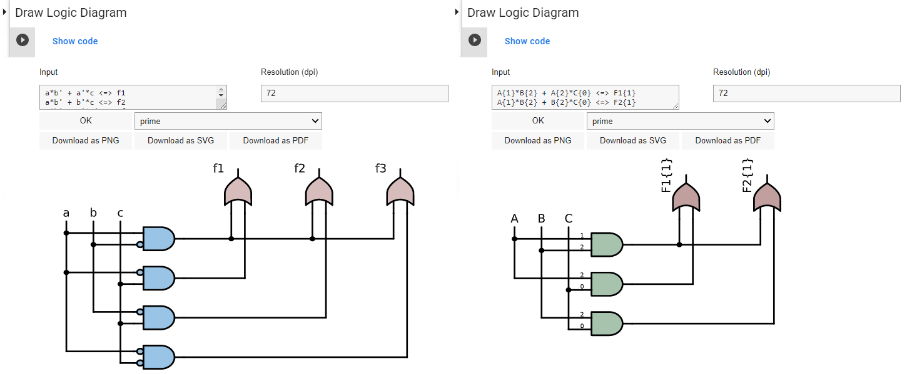

# Summary 

Combinational Regularity Analysis (CORA) [@thiem_et_al_2022] is a new member of the family of configurational comparative methods (CCMs). The most sophisticated CCMs infer INUS structures from sets of configurational data [@thiem_2022a]. CORA generalizes the capabilities of existing CCMs. By means of Boolean optimization algorithms for multi-output data, CORA can infer INUS structures that include complex conjunctive effects. The accompanying and eponymous package `CORA` is an open-source Python tool, hosted on GitHub and deployed on the Google Colab platform, with which such structures can be identified.

# Statement of need

Modern CCMs can infer regularity-theoretic causal structures from categorical data. The most sophisticated of these structures are so-called "INUS" structures. "INUS" refers to an **i**nsufficient but **n**on-redundant part of a condition that is **u**nnecessary but **s**ufficient for some outcome [@mackie_1965]. INUS structures are syntactically codified as two-level Boolean functions, such as $a\cdot b' + c' \Leftrightarrow z$, where $a$, $b$, $c$ and $z$ are Boolean literals, $\text{"} \cdot \text{"}$ represents the Boolean multiplication operator, $\text{"} + \text{"}$ the Boolean addition operator, $\text{" } ' \text{ "}$ the Boolean negation operator, and $\text{"}\Leftrightarrow\text{"}$ the Boolean implication operator. Branches of Boolean algebra include, most importantly, set theory, propositional logic and switching circuit theory [@lewin_protheroe_1992].

So far, the two most sophisticated CCMs have been Qualitative Comparative Analysis (QCA) [@ragin_1987] and Coincidence Analysis (CNA) [@baumgartner_2009]. For QCA, several software packages exist, each with different functionality [@cronqvist_2019; @dusa_2022; @ragin_davey_2019; @thiem_2018]. However, since there is no harmonization of procedures in QCA, different software packages often generate very different results despite identical data input and parameter settings [@thiem_dusa_2013]. For CNA, the `cna` package is available [@ambuhl_baumgartner_2022].

QCA and CNA can analyze single outputs only. Although CNA has been built for analyses with multiple outputs, its algorithm has to process each output one after another. Many scientific research problems, however, require the simultaneous analysis of multiple effects, such as analyses of multimorbidity [@suls_green_2019]. CORA offers a solution. It generalizes QCA and CNA by allowing the simultaneous analyses of multiple outputs, and can therefore discover more complex INUS structures. To this end, CORA implements adaptations of optimization algorithms originally developed for the design of multi-output switching circuits. In addition, CORA offers a systematic possibility to mine configurational data. Last, but not least, with CORA, researchers can draw on logic diagrams to communicate their results. The software tool `CORA` implements the eponymous method and all aforementioned features.

# Functionality and design 

Figure <a href="#fig:structure" data-reference-type="ref" data-reference="fig:structure">1</a> shows the internal structure of `CORA`. Two distinct Python packages constitute its foundation. While the `CORA` package is responsible for all processes related to algorithmic optimization, the `LOGIGRAM` package provides graphical functionality for the production of logic diagrams. On the middle layer, these two Python packages are combined in CORA's Colab notebook, which provides the visual interface to the user. This end-user interface represents the top level of `CORA` on which all interactions between the user and software take place. The input the user has to provide consists of a set of `CORA`-compatible data and the specification of all required modelling parameters. Following the process of algorithmic optimization, a solution is generated. In `CORA`, such solutions take the form of a set of irredundant systems of two-level Boolean functions. These systems, or any stand-alone function in disjunctive normal form provided independently of `CORA`, can then also be rendered through `LOGIGRAM` as a logic diagram.

The user interface of CORA's Colab notebook is shown in Figure <a href="#fig:notebook" data-reference-type="ref" data-reference="fig:main">2</a>. It guides users through the analysis in nine steps, the last two of which are optional: (1) the initialization of the framework and (2) default settings, the (3) choice and (4) import of data, the (5) specification of the inputs and outputs, the (6) setting of search parameters and thresholds for data fit statistics, (7) the computation of the solution, (8) the initialization of `CORA`'s visualization module and, finally, (9) the drawing and export of logic diagrams. In QCA and CNA, the existence of multiple models that fit some set of data equally well is called model ambiguity [@baumgartner_thiem_2017]. The analogue of model ambiguitiy in `CORA` is called "system ambiguity". A further commonality with CNA, but difference to QCA, is that `CORA` does not permit the manipulation of don't care terms. So-called "conservative" or "intermediate" solutions, which produce unacceptably high rates of false positives [@baumgartner_thiem_2020; @thiem_2022b], are not offered in `CORA`. In contrast to both QCA and CNA, `CORA` does not allow the use of fuzzy variables because of the numerous inferential problems associated with such variables. However, `CORA` comes with full support for multi-value inputs and multi-value outputs.     

# Graphics 

Logic diagrams are graphical representations of Boolean-algebraic functions that have so far almost exclusively been used in electrical engineering. Over the last 10 years, however, scientists from other disciplines have begun to discover the utility of logic diagrams [@delorenzo_schmidt_2018; @pearl_2009; @thiem_et_al_2020]. The `LOGIGRAM` package in `CORA` is an interactive tool for the standardized production of two-level logic diagrams, called "logigrams" in CORA. Two examples of a logigram, including the interface through which they are produced, are plotted in Figure <a href="#fig:logigrams" data-reference-type="ref" data-reference="fig:logigrams">3</a> for a binary (left) and a multi-value system (right), respectively.

# Future work

Future work on `CORA` aims to explore several different directions. We list them in the order of priority:

-   So far, `CORA` offers two exact optimization algorithms. At least one heuristic algorithm will be added. Heuristic algorithms are not guaranteed to find a global optimum, but they can handle larger data sets.

-   For both exact and heuristic algorithms, we aim to implement procedures for sequential circuit analysis. In sequential circuit analysis, the order in which variables of interest occur matters.

-   Currently, data-mining is only implemented for inputs. A maximally objective analysis would also allow for data-mining on the side of outputs.

-   The `LOGIGRAM` module will receive further functionality.

# Requirements

`CORA` and `LOGIGRAM` are implemented in Python 3.7. For users who would like to directly run these in a Python environment, Python 3.7 or higher versions are required. For running `CORA` on Google Colab, a Google account is required.

# Funding

The Swiss National Science Foundation has generously funded this research under grant award number PP00P1\_202676 to AT. The funding body had no role in the design, writing or publication of this manuscript.

# References 

